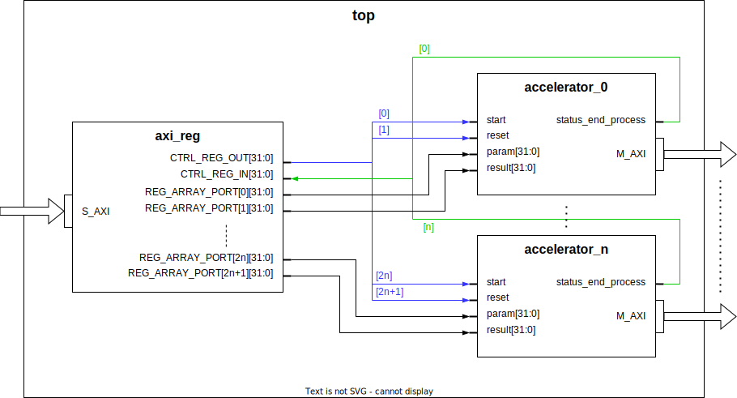
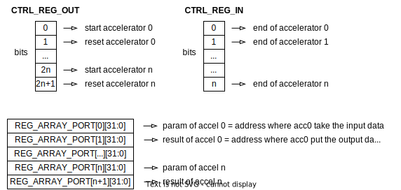

# LoCod FPGA design architecture

Bellow is presented the global FPGA architecture of the LoCod project :

 

## Working principle

First, a Slave AXI4 Lite port is used to write and read to control registers. These registers are then used to control each FPGA accelerator.

Addresses of each registers are presented in the file [axi_reg.md](../src/axi_reg/doc/axi_reg.md).

The first two registers are used as control registers, with each bit controlling the state of the accelerators : start, reset and end status.
Then, three others registers are linked to each accelerator. The fist to indicate the RAM addresse where the accelerator must retreive the input data, the second to indicate the addresse where the accelerator must write the output data, and the third to retreive the latched process duration once the accelerator has finished.

 

At the output of the top module, we find as many AXI4 Lite Master buses as there are instantiated accelerators.

Each AXI master will communicate with the SoC RAM to allow the accelerators to read and write computed data.

 

## Registers connections

Here are described the connections between registers of axi_reg component and input ports of each accelerator for n accelerators instanciated :

