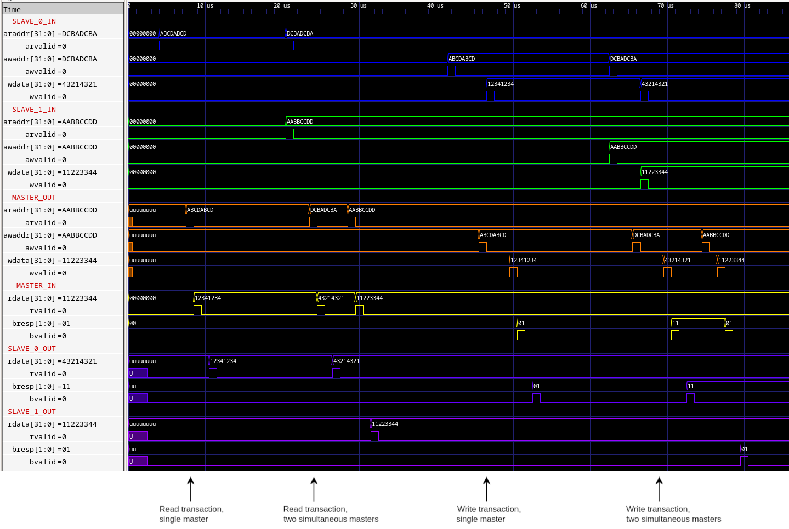
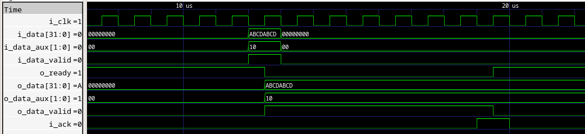
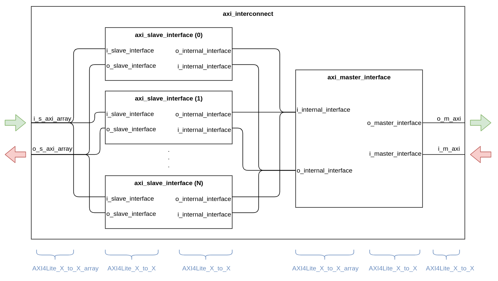
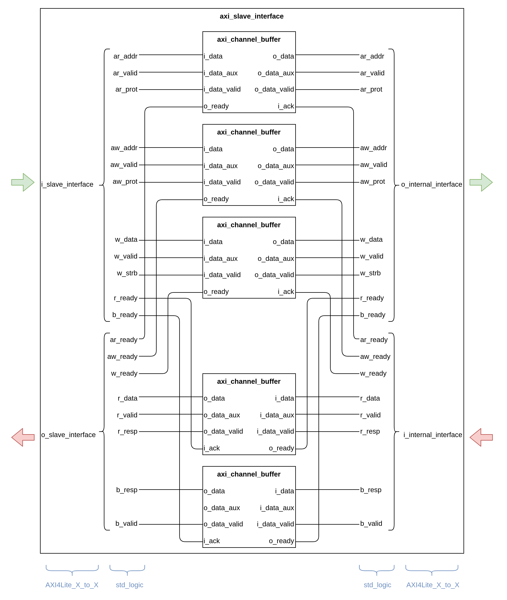
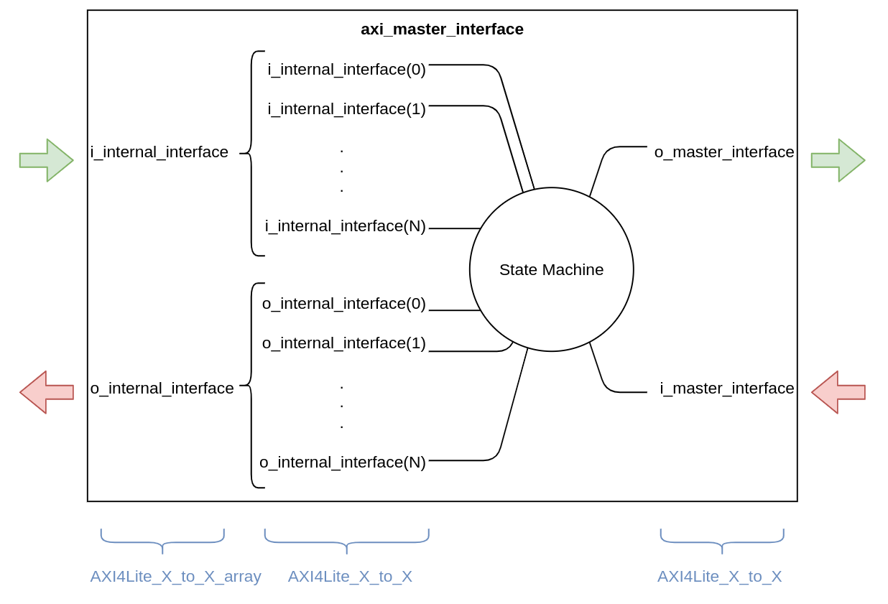
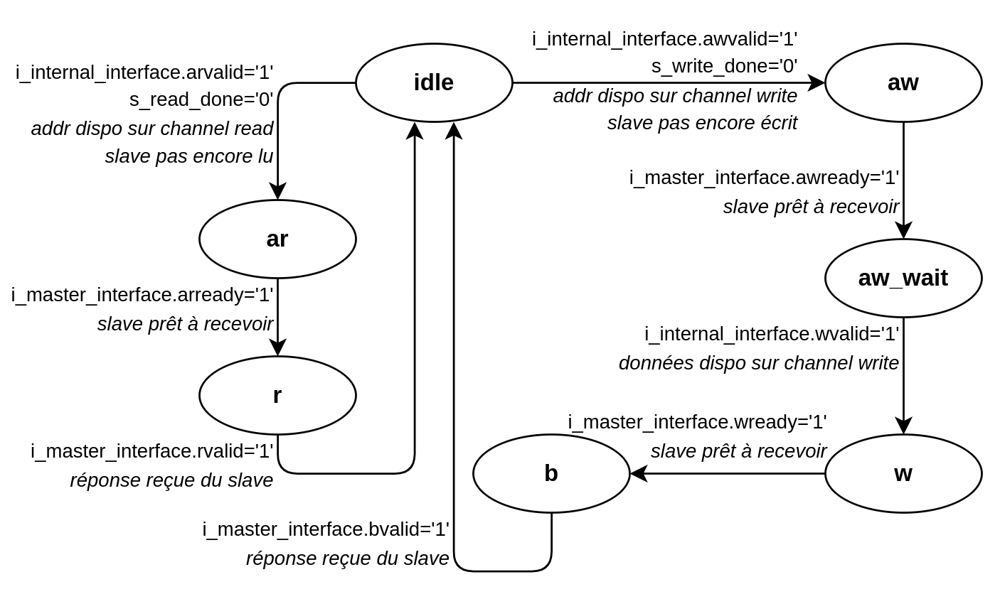

# AXI_INTERCONNECT

L'*axi_interconnect* N-to-1 est un bridge AXI permettant de connecter plusieurs *master* à un unique *slave*, afin qu'ils communiquent selon le protocole *AXI4-light*. L'IP prend en charge la transmission des packets envoyés par les différents master vers le salve, et la répartition des réponses de ce dernier vers les master correspondants. Elle met également en place une bufferisation des packets, afin d'éviter les pertes de données en cas de transmission simultanée par plusieurs master.

## Utilisation

Description des génériques

|Generic|Fonction|
|---|---|
|NB_MASTER|Nombre de master à connecter|
|ADDR_SIZE|Taille des bus d'adresse|
|DATA_SIZE|Taille des bus de donnée|
|PROT_SIZE|Taille des flags de protection|
|STRB_SIZE|Taille des flags de byte strobe|
|RESP_SIZE|Taille des flags de réponse|

## Description des sous-modules

### IP axi_channel_buffer

Les *axi_channel_buffer* sont les blocs mettant en place la bufferisation des données envoyées par le périphériques *émettant* (et valides pour un seul cycle horloge) avant lecture par le périphérique *recevant*.
Lorsqu'une donnée est présentée en entrée (et validée par le flag *i_data_valid*), le buffer l'enregistre et la maintien en sortie, tout en le signalant par le flag *o_data_valid*. Il abaisse également le flag *o_ready*, signifiant au périphérique *émettant* qu'il ne peut pas recevoir d'autre packets car déjà plein.
Lorsque le périphérique *recevant* a effectivement lu la donnée, il le signale au buffer via le flag *i_ack*. Le buffer redevient alors *ready* et peut overwrite la donnée précédemment enregistrée.

|Signal|Port|Size|Fonction|
|---|---|---|---|
|i_clk|in|1|Horloge système|
|i_rst_n|in|1|Reset, actif à l'état bas|
|i_data|in|BUS_SIZE|Données reçues (addr ou data selon channel axi)|
|i_data_aux|in|AUX_BUS_SIZE|Données auxiliaires reçues (prot, strb ou resp selon channel axi)|
|i_data_valid|in|1|Flag de validité des données reçues|
|o_ready|out|1|Buffer prêt à recevoir|
|o_data|out|BUS_SIZE|Données retransmises (addr ou data selon channel axi)|
|o_data_aux|out|AUX_BUS_SIZE|Données auxiliaires retransmises (prot, strb ou resp selon channel axi)|
|o_data_valid|out|1|Flag de validité des données retransmises|
|i_ack|out|1|Flag de réinitialisation du buffer|

### Type record pour les interfaces

Pour réaliser les interfaces, les signaux du bus AXI ont été regroupés dans des types record, afin de faciliter leur instanciation :

- *AXI4Lite_m_to_s* regroupe les signaux émis par le master vers le slave (channel *addr_read*, *addr_write* et *write* ainsi que signaux *ready* des channel *read* et *resp*).
- *AXI4Lite_s_to_m* regroupe les signaux émis par le slave vers le master (channel *read* et *resp* ainsi que signaux *ready* des channel *addr_read*, *addr_write* et *write*).
- *AXI4Lite_m_to_s_array* est un tableau de *AXI4Lite_m_to_s*, de taille équivalente au nombre de master à connecter.
- *AXI4Lite_s_to_m_array* est un tableau de *AXI4Lite_s_to_m*, de taille équivalente au nombre de master à connecter.

### IP axi_slave_interface

Les *axi_slave* regroupent 5 *axi_channel_buffer* pour les 5 channel du protocole *AXI4-Light*. Un *axi_slave* est instancié pour chaque master devant être connecté à l'*axi_interconnect*.
Les ports *slave_interface* correspondent à l'interface type slave de l'IP, qui doit être connectée au master, et les ports *internal_interface* sont connectés à la machine interne de l'*axi_interconnect*. Les signaux *ready* en mode *in* des ces ports sont en réalité utilisés comme des signaux *ack* pour les *axi_channel_buffer* (cf description *axi_channel_buffer*).

|Signal|Port|Size|Fonction|
|---|---|---|---|
|i_clk|in|1|Horloge système|
|i_rst_n|in|1|Reset, actif à l'état bas|
|i_slave_interface|in|AXI4Lite_m_to_s|Données reçues du master|
|o_slave_interface|out|AXI4Lite_s_to_m|Données envoyées au master|
|i_internal_interface|in|AXI4Lite_s_to_m|Données reçues en interne|
|o_internal_interface|out|AXI4Lite_m_to_s|Données envoyées en interne|

### IP axi_master_interface

L'*axi_master_interface* contient les machines d'état gérant les séquences d'envoi et de réception des packets. C'est également elle qui assure l'interface type master de l'IP, via les ports *master_interface* devant être connectés à l'unique slave. Les ports *internal_interface* sont connectés à leurs homologues sur les IP *axi_slave_interface*.

|Signal|Port|Size|Fonction|
|---|---|---|---|
|i_clk|in|1|Horloge système|
|i_rst_n|in|1|Reset, actif à l'état bas|
|i_internal_interface|in|AXI4Lite_s_to_m_array|Données reçues en interne|
|o_internal_interface|out|AXI4Lite_m_to_s_array|Données envoyées en interne|
|i_master_interface|in|AXI4Lite_m_to_s|Données reçues du slave|
|o_master_interface|out|AXI4Lite_s_to_m|Données envoyées au slave|

Toutes les transactions sont gérées par une unique machine d'états (l'utilisation des interfaces ne permettant pas de splitter la gestion en différents process, les type record étant considérés comme ports uniques malgré les multiples signaux qu'ils contiennent, le synthétiseur ne parvient pas à générer une interface drivée par plusieurs process).
La machine fonctionne selon un principe de round-robin, en interrogeant les *axi_slave_interface* chacune leur tour.

Si aucun des channel ne présente de donnée à transmettre, *s_master_index* est incrémenté et la machine d'état interroge le master suivant.

Si une donnée est disponible sur l'un des channel (*addr_read* ou *addr_write*), la machine enregistre les données dans des registres internes, acquitte le buffer afin qu'il se vide, et passe dans l'état correspondant.
Les états correspondants au différents channel fonctionne tous selon le même principe :
- Channel bufferisé (côté interne) : attendre que le channel côté master soit *ready*, présenter et valider la donnée, passer à l'état suivant.
- Channel non-bufferisé (côté master) : attendre que la donnée soit valide, la récupérer et la transmettre au buffer interne, passer à l'état suivant.

Une fois un transaction de *read* ou de *write* effectuée (retour à l'état *idle*), le flag correspondant (*s_read_done* ou *s_write_done*) est levé. Si une donnée est de nouveau disponible sur le même channel mais que le flag correspondant est levé, la machine passe malgré tout au master suivant, et ce afin d'éviter tout risque de famine. Chaque master peut donc effectuer une seule transaction *read* et une seule transaction *write* par tour.
