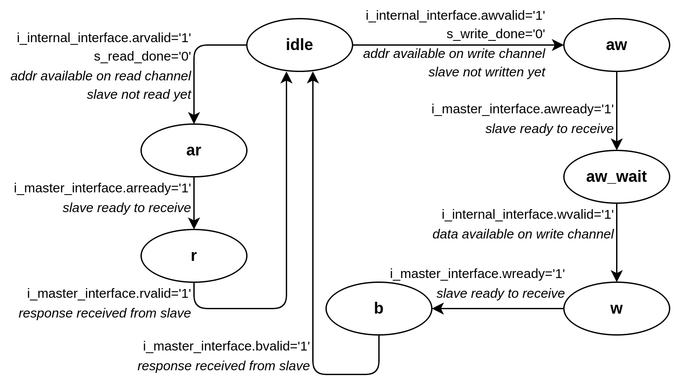

# AXI_INTERCONNECT

The *axi_interconnect* N-to-1 is an AXI bridge that connects several *masters* to a single *slave*, allowing them to communicate using the *AXI4-light* protocol. The IP handles the transmission of packets sent by the various masters to the salve, and the distribution of the latter's responses to the corresponding masters. It also buffers packets to prevent data loss in the event of simultaneous transmission by several masters.

## Usage

Generics description

|Generic|Function|
|---|---|
|NB_MASTER|Number of masters to connect|
|ADDR_SIZE|Address buses length|
|DATA_SIZE|Data buses length|
|PROT_SIZE|Protection flags length|
|STRB_SIZE|Strobe flags length|
|RESP_SIZE|Response flags length|

## Sub-modules description

### IP axi_channel_buffer

The *axi_channel_buffer* are blocks that allow data sent by the *sending* device (and valid for a single clock cycle) to be buffered before it is read by the *receiving* device.
When data is presented on the input (and validated by the *i_data_valid* flag), the buffer saves it and holds it on the output, signalling it with the *o_data_valid* flag. It also sets the *o_ready* flag, telling the *transmitting* device that it can't receive any more packets, as it's already full.
When the *receiving* device has actually read the data, it reports it to the buffer via the *i_ack* flag. The buffer then becomes *ready* again and can overwrite the previously stored data.

|Signal|Port|Size|Function|
|---|---|---|---|
|i_clk|in|1|System clock|
|i_rst_n|in|1|Reset, low-state active|
|i_data|in|BUS_SIZE|Received data (addr or data depending on axi channel)|
|i_data_aux|in|AUX_BUS_SIZE|Received auxiliary data (prot, strb or resp depending on axi channel)|
|i_data_valid|in|1|Validity flag for received data|
|o_ready|out|1|Buffer ready to receive|
|o_data|out|BUS_SIZE|Forwarded data (addr or data depending on axi channel)|
|o_data_aux|out|AUX_BUS_SIZE|Forwarded auxiliary data (prot, strb or resp depending on axi channel)|
|o_data_valid|out|1|Validity flag for forwarded data|
|i_ack|out|1|Buffer reset flag|

### Type records for interfaces

To create the interfaces, the AXI bus signals have been grouped into type records to make them easier to instantiate :

- *AXI4Lite_m_to_s* groups the signals sent by the master to the slave (*addr_read*, *addr_write* and *write* channels as well as *ready* signals from *read* and *resp* channels).
- *AXI4Lite_s_to_m* groups the signals sent by the slave to the master (*read* and *resp* channels as well as *ready* signals from *addr_read*, *addr_write* and *write* channels).
- *AXI4Lite_m_to_s_array* is an array of *AXI4Lite_m_to_s*, of size equal to the number of masters to be connected.
- *AXI4Lite_s_to_m_array* is an array of *AXI4Lite_s_to_m*, of size equal to the number of masters to be connected.

### IP axi_slave_interface

The *axi_slave* groups 5 *axi_channel_buffers* for the 5 channels of the *AXI4-Light* protocol. An *axi_slave* is instantiated for each master to be connected to the *axi_interconnect*.
The *slave_interface* ports correspond to the IP's slave interface, which must be connected to the master, and the *internal_interface* ports are connected to the *axi_interconnect*'s internal state machine. The *in* mode *ready* signals for these ports are actually used as *ack* signals for the *axi_channel_buffer* (see *axi_channel_buffer* description).

|Signal|Port|Size|Function|
|---|---|---|---|
|i_clk|in|1|System clock|
|i_rst_n|in|1|Reset, low-state active|
|i_slave_interface|in|AXI4Lite_m_to_s|Data received from master|
|o_slave_interface|out|AXI4Lite_s_to_m|Data sent to master|
|i_internal_interface|in|AXI4Lite_s_to_m|Data received from internal logic|
|o_internal_interface|out|AXI4Lite_m_to_s|Data sent to internal logic|

### IP axi_master_interface

The *axi_master_interface* contains the state machines that manage the sending and receiving of packets. It also provides the IP's master interface, via the *master_interface* ports which must be connected to the single slave. The *internal_interface* ports are connected to their counterparts on the *axi_slave_interface* IPs.

|Signal|Port|Size|Function|
|---|---|---|---|
|i_clk|in|1|System clock|
|i_rst_n|in|1|Reset, low-state active|
|i_internal_interface|in|AXI4Lite_s_to_m_array|Data received from internal logic|
|o_internal_interface|out|AXI4Lite_m_to_s_array|Data sent to internal logic|
|i_master_interface|in|AXI4Lite_m_to_s|Data received from slave|
|o_master_interface|out|AXI4Lite_s_to_m|Data sent to slave|

All transactions are managed by a single state machine (as the use of interfaces does not allow management to be split into different processes, and type records are considered as single ports despite the multiple signals they contain, the synthesizer is unable to generate an interface driven by several processes).
The machine operates on a round-robin principle, interrogating the *axi_slave_interface* in turn.

If none of the channels has data to transmit, *s_master_index* is incremented and the status machine interrogates the next master.

If data is available on one of the channels (*addr_read* or *addr_write*), the machine stores the data in internal registers, acknowledges the buffer so that it empties, and switches to the corresponding state.
The states corresponding to the different channels all work on the same principle:
- Buffered channel (internal side): wait until the channel on the master side is *ready*, present and acknowledge the data, then move on to the next state.
- Unbuffered channel (master side): wait until the data is valid, retrieve and transmit it to the internal buffer, then move on to the next state.

Once a *read* or *write* transaction has been completed (return to *idle* state), the corresponding flag (*s_read_done* or *s_write_done*) is raised. If data is available again on the same channel, but the corresponding flag is raised, the machine moves on to the next master, to avoid any risk of starvation. Each master can therefore perform a single *read* transaction and a single *write* transaction per turn.